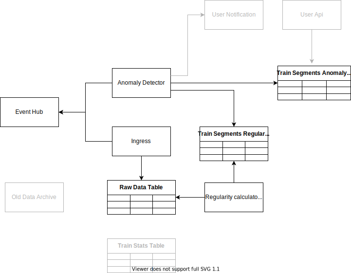
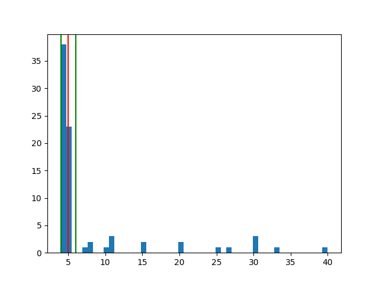
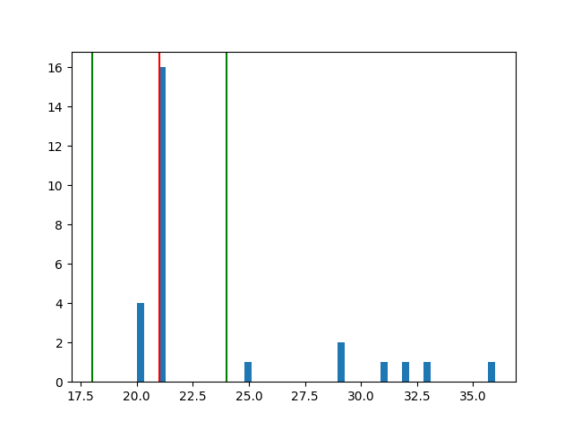

What is this?

---

It is a platform that will store and analyse data related to arrival and departure of trains. 

# Architecture
The vision, which can change in future, is captured within this diagram (which is not yet complete)


We will capture the events with an Event Hub, then the data will be extracted by the Ingress and stored within Tables. Then we will focus on detection anomalies within ingested data and a notification system that lets us know should any anomaly gets detected along with basic UI showing them.

# Technology Stack

- Azure
- ARM
- .net
- python for some prototyping
- More to come...

# Data Source 

An easy way how to get sensible data is to use [Open Transport Tycoon Deluxe](openttd.org). I forked the repository (see [here](https://github.com/jaroslavknotek/OpenTTD/tree/feature/train_station_logging)) and plugged in a trivial logging that stores all arrival and departure events. 

The data look like this:
```json
{
    "stationId": "46",
    "stationName": "Abertown Woods",
    "vehicleId": "3",
    "unitNumber": "80",
    "datetime": "20201120T102030",
    "orderNumberCurrent": "0",
    "orderNumberTotal": "2",
    "type": "left"
}
```

I don't plan to have any central register of station or trained that will be managed separately therefore the incoming data are bit denormalized. 

There are information about station (`stationId`, `stationName`), about vehicle (`vehicleId`,`unitNumber` used for identification within OTTD) about the order (`orderNumberCurrent`, `orderNumberTotal`) and some about the event itself (`type`, `datetime`).

The `orderNumber` is a number of a record (could be station or a waypoint) within the timetable. We assume that the record will never change. The element `orderNumberCurrent` and `orderNumberTotal` represents the order when the event was fired and out of how many respectively. So far we track only stations therefore some order numbers may be missing.

# Requirements

- Azure account
- C# basics
- .NET 5 SDK
- Tools:
  - [Azure Function Core Tools](https://docs.microsoft.com/en-us/azure/azure-functions/functions-run-local#v2)
  - [Azure CLI](https://docs.microsoft.com/en-us/cli/azure/install-azure-cli)


# Implementation

In this section I will cover individual increments

## Raw Data Storage

The aim is to s

The project is limited by its costs - 130 Euro per month.

Create a new resource group and deploy the arm template `resources.azrm.json`.

```ps1
$resourceGroup = "train-platform-rg"
az group create --location 'WestEurope' -n $resourceGroup
az deployment group create `
   --name "deploy-trains" `
   --resource-group $resourceGroup `
   --template-file "arm/resources.azrm.json" `
   --parameters "arm/resources.azrm.parameters.json"
```

Create an azure function project.

```ps1
func init "AzureFunctions" --worker-runtime "dotnetIsolated"
func new --name "IngressEventHub" --template "eventhub"
```

Implement storing the event like [here](../source/cs/Shared/Services/TrainEventsRepository.cs) 

**Note**: The version may change in time, you should use tag `raw-data-ingress` to locate the appropriate version of the codebase. In such codebase you can also find a project `ConsoleApplication` that is used for local debugging/developing purposes.

## Anomaly Calculation

In this section, we will add a trivial anomaly detection module (that may be improved later). The anomaly detection is trivial because of our assumption that the train track never changes and if it does, then we say that it is different train and we start from scratch disregarding all the data prior to the change.



Few components will be added. 
- Table of regular data that we will use to calculate anomalies from
- Table of found anomalies
- Regularity calculator job.

We start with slightly changing the infrastructure - we will need to utilize [consumer groups](https://docs.microsoft.com/en-us/azure/event-hubs/event-hubs-features#consumer-groups) so we need to create them and add them to the function config in the arm template. Additionally, we add the tables of segment regularities and then the anomalies themselves.

### Calculate the anomalies

What is an anomaly exactly in this context?

Trains go from a station A, to a station B, to a station Z. We track the time between points p_1 and p_2 and time spent there. 

Assumptions:
- Data may be slightly changing over time 

Goal:
- Track the worst case.

We can therefore start with a trivial solution. Digging through the data I came up with an idea that anything outside the +-10% of the distance from the median is an anomaly. The experiments shows that it may work. 

Two excerpts:



The solution is far from optimal but it's a good start to iterate over (should we want).

Every time an event comes, we add it to the table, remove the last one and recalculate the regularities.

Then I will search for some cool algorithms that will help me to calculate the median online in an optimal way or I will come up with something completely new.

For that, we will reuse the table that is already in place and store the new events in there. We will need to fix the row keys to find the segments for the given train easily.

### Detect anomalies

---

I am leaving out the concept of segments. It's hard to enrich each train event with where it came from. The order number suffices for calculating anomalies